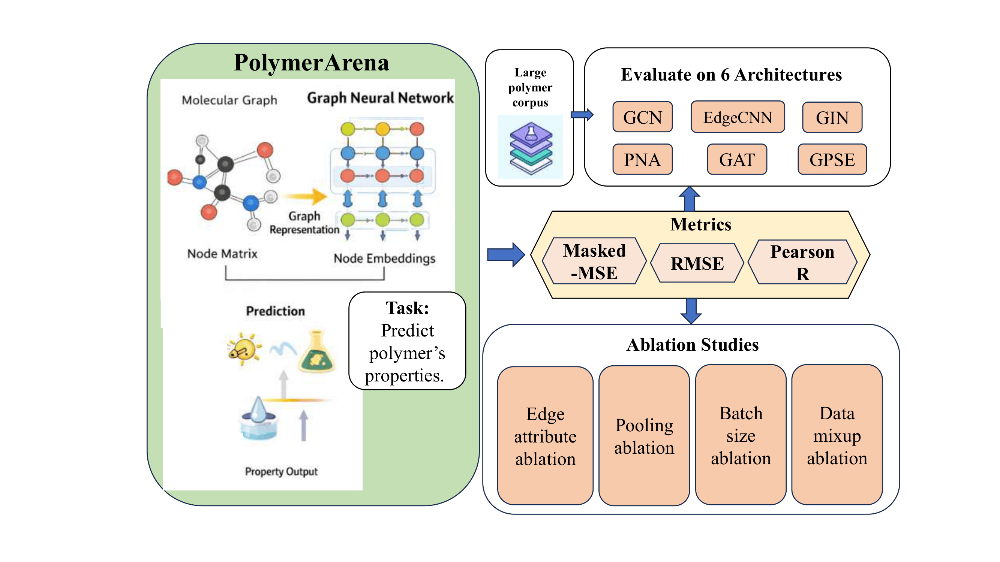

# PolymerArena


**Benchmarking Multi-Task Graph Learning Models on Polymer Property Prediction**

Paper under consideration at ICML'26

## 📌 Overview

**PolymerArena** is a comprehensive benchmarking framework for evaluating **multi-task graph learning models** applied to **polymer property prediction**. Graph neural networks (GNNs) and related graph-based models have shown strong performance in molecular and materials informatics. PolymerArena systematically evaluates a representative set of such models in a **multi-task learning setting**, establishing reproducible baselines for future research in polymer informatics and machine learning-assisted materials design.

## 🔄 Workflow
<p align="center">
  
</p>


## 📂 Repository Structure


## 📚 Citation
```bibtex
@article{chemrxiv2026polymerarena,
  title={PolymerArena: Benchmarking Multi-Task Graph Learning Models on Polymer Property Prediction},
  author={Zeng, Yinqi and Qiu, Ruizhong and Bei, Yuanchen and Tong, Hanghang and Li, Renjie},
  journal={ChemRxiv},
  year={2026},
  doi={10.26434/chemrxiv.10001868/v1}
}
```
